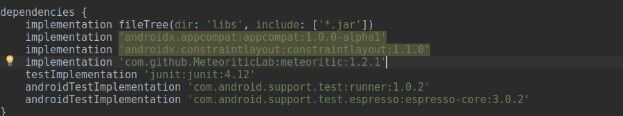
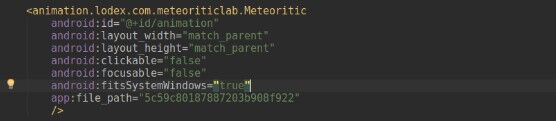
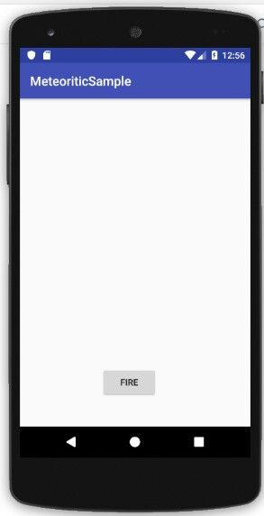
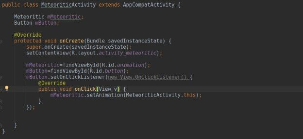
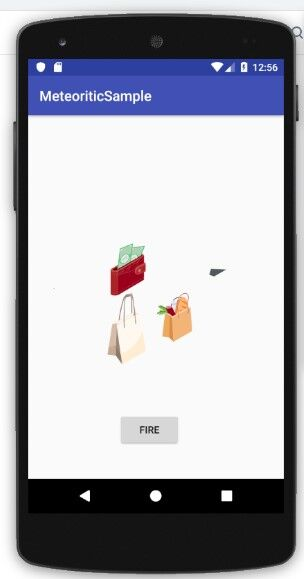

GitHub Description
==================

#### Introduction

Meteoritic is a mobile library for Android and iOS that renders screen
effects and animation delights to help drive user engagement. Visit
[https://meteoritic.io](https://meteoritic.io/) to learn more.

[Watch
Video](https://www.youtube.com/watch?v=vJ44sbieN9o&feature=youtu.be)

#### This is a sample repo to help you try out Meteoritic library and test out its features. Also check out the [IOS repo](https://github.com/MeteoriticLab/MeteoriticSample-ios)

#### Installing Meteoritic on Android

Start by Cloning this repo and to try out the sample app and test
Meteoritic’s features

#### In your Gradle file add these lines. to implement the lib.

allprojects { repositories { maven { url 'https://jitpack.io' } } } //
implementation dependencies { implementation
'com.github.MeteoriticLab:meteoritic:Tag' }

#### In your Layout add the view and pass your animation id

 

#### To add an activity. Initialize your Meteoritic View and pass the context.

// init Meteoritic mMeteoriticView= findViewById(R.id.animation); //call
animation mMeteoriticView.setAnimation(MainActivity.this)

 
